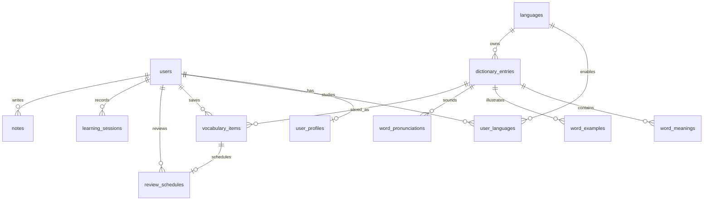

# Data model / ERD

The user requirement chooses MySQL, so the schema uses MySQL 8.4-compatible SQL. The model is language-neutral: a dictionary entry points to a `languages` row instead of embedding `english_word`, `chinese_word`, etc.

## Phase 1 ERD

## Core tables

| Table | Purpose | Important indexes |
| --- | --- | --- |
| `users` | identity and auth subject | unique email |
| `user_profiles` | native language, goals and display data | user unique |
| `languages` | supported language registry | unique code |
| `user_languages` | one user’s independent target-language progress | user/language unique |
| `dictionary_entries` | lemma, slug, IPA, CEFR and metadata | language/slug unique, FULLTEXT word |
| `word_meanings` | definitions and translations | entry/order |
| `word_examples` | copyright-safe seed examples | meaning/order |
| `word_pronunciations` | UK/US audio metadata | entry/accent unique |
| `vocabulary_items` | saved words, tags and notes | user/entry unique |
| `review_schedules` | mastery and next review | user/due_at |
| `learning_sessions` | daily study totals | user/studied_at |
| `grammar_topics` | level-based grammar catalog | level/slug unique |
| `courses` | course catalog | language/slug unique |
| `course_units` | course curriculum grouping | course/order |

Phase 2 extends this model with meanings, forms, relations, collocations, exercises, attempts, writing submissions, pronunciation attempts, AI conversations, achievements and subscriptions without changing the language abstraction.
